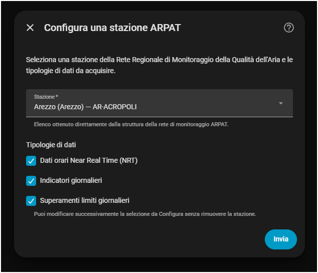

# ARPAT Toscana per Home Assistant

[](https://github.com/m0m4x/ha-arpat-toscana/releases)
[](https://github.com/m0m4x/ha-arpat-toscana/actions/workflows/validate.yml)
[](https://github.com/m0m4x/ha-arpat-toscana/actions/workflows/hassfest.yml)

Custom integration per Home Assistant per acquisire i dati della **qualità dell'aria** pubblicati da **ARPAT - Agenzia regionale per la protezione ambientale della Toscana** tramite gli Open Data ufficiali della **Rete Regionale di Monitoraggio della Qualità dell'Aria**.

La versione 0.2.0 gestisce tre tipologie di dati, selezionabili indipendentemente:

- **Dati orari Near Real Time (NRT)**;
- **Indicatori giornalieri**;
- **Superamenti limiti giornalieri**.

> **Progetto indipendente e non ufficiale.** Non è sviluppato, approvato o supportato da ARPAT.

## Installazione con HACS

[](https://my.home-assistant.io/redirect/hacs_repository/?owner=m0m4x&repository=ha-arpat-toscana&category=integration)

Dopo l'installazione e il riavvio di Home Assistant:

[](https://my.home-assistant.io/redirect/config_flow_start/?domain=arpat_toscana)

## Configurazione

Da **Impostazioni → Dispositivi e servizi → Aggiungi integrazione**, cerca **ARPAT Toscana**.

Il config flow:

1. scarica l'elenco aggiornato delle stazioni dalla struttura ufficiale della rete regionale ARPAT;
2. permette di scegliere la stazione;
3. permette di selezionare una o più tipologie di dati.

Le tipologie disponibili sono:

```text
☑ Dati orari Near Real Time (NRT)
☑ Indicatori giornalieri
☑ Superamenti limiti giornalieri
```



Dopo la configurazione è possibile modificare la selezione da:

**Impostazioni → Dispositivi e servizi → ARPAT Toscana → Configura**

senza rimuovere e aggiungere nuovamente la stazione.

## Dati orari Near Real Time (NRT)

ARPAT descrive questo dataset come dati orari rilevati in una stazione specifica. Il parametro `last` restituisce l'ultimo valore campionato.

La struttura JSON NRT contiene anche numerosi campi `null` che non implicano necessariamente che il relativo parametro sia pubblicato in NRT dalla stazione.

Per questo motivo, dalla versione 0.2.0, l'integrazione **non usa più l'elenco generale `SENSORI` per creare le entità NRT**.

All'avvio viene analizzato il dataset NRT disponibile per la stazione e vengono creati solamente i parametri che hanno pubblicato almeno un valore numerico. Successivamente il normale polling utilizza l'endpoint `/last`.

Esempio: se una stazione pubblica in NRT solamente NO₂ e O₃, vengono create solamente:

```text
NO₂ NRT
O₃ NRT
```

anche se nel tracciato JSON esistono campi come `PM10`, `PM2.5`, `SO2`, `CO`, `H2S` o `BENZENE` valorizzati a `null`.

Se un parametro NRT realmente utilizzato dalla stazione restituisce `null` nell'ultimo campione, l'entità resta correttamente presente con stato **Sconosciuto** per quel campione; non viene riutilizzato un valore orario precedente come se fosse corrente.

## Indicatori giornalieri

Gli **Indicatori giornalieri** provengono dal **Bollettino regionale della qualità dell'aria**. ARPAT indica che i grafici degli indicatori giornalieri si basano sui dati dei bollettini con **validazione di primo livello**.

Questo dataset è distinto dal NRT. Una stazione può quindi pubblicare, ad esempio, PM2.5 tra gli indicatori giornalieri pur non pubblicandolo nei dati orari NRT.

Le entità vengono create dinamicamente sulla base della riga della stazione nel bollettino più recente.

Esempi:

```text
PM10 indicatore giornaliero
PM2.5 indicatore giornaliero
NO₂ indicatore giornaliero
```

La codifica ARPAT viene interpretata così:

- valore numerico → entità con valore;
- `n.d.` → indicatore pertinente, ma dato non disponibile: entità presente con stato Sconosciuto;
- `-` → parametro non pubblicato per quella stazione: nessuna entità.

Il campo `PM2dot5` del bollettino viene normalizzato in Home Assistant come `PM2.5`.

Il campo originale `CONTATORE_SUPERAMENTI`, quando presente, viene conservato come attributo dei sensori giornalieri ma non trasformato in una nuova entità finché non ne viene formalizzata separatamente la semantica.

## Superamenti limiti giornalieri

Viene creato un sensore persistente:

```text
Superamenti limiti giornalieri
```

con:

- stato: numero di superamenti riportati nell'ultima pubblicazione disponibile;
- `data_bollettino`: data di osservazione;
- `dettaglio_superamenti`: parametro, sigla e valore degli eventuali superamenti.

Quando ARPAT non rileva superamenti, il servizio restituisce esplicitamente `superamenti: 0` e l'entità rimane a zero, mantenendo uno storico coerente nel Recorder.

## Frequenze di aggiornamento

- NRT: ogni **30 minuti**;
- Indicatori giornalieri: al massimo ogni **2 ore**;
- Superamenti limiti giornalieri: al massimo ogni **2 ore**.

Se NRT non è selezionato, l'intero coordinator lavora con intervallo di 2 ore.

## Endpoint utilizzati

Base Open Data:

```text
https://opendata.arpat.toscana.it/temi-ambientali/aria/qualita-aria
```

Struttura rete regionale:

```text
/rete_monitoraggio/rete_json/regionale
```

Dati NRT disponibili per la stazione:

```text
/dati_orari_real_time/json_orari_nrt/[NOME_STAZIONE]
```

Ultimo dato NRT:

```text
/dati_orari_real_time/json_orari_nrt/[NOME_STAZIONE]/last
```

Ultimo bollettino regionale / Indicatori giornalieri:

```text
/bollettini/bollettino_json/regionale
```

Superamenti nell'ultimo bollettino per stazione:

```text
/bollettini/superamenti_json/-/[NOME_STAZIONE]
```

Documentazione ARPAT:

https://www.arpat.toscana.it/open-data/open-data-sulla-qualita-dellaria/

## Migrazione dalla 0.1.x

Le configurazioni esistenti vengono migrate automaticamente alla versione 2 del config entry mantenendo abilitate le due tipologie già gestite dalla 0.1.x:

- NRT;
- Superamenti limiti giornalieri.

Gli **Indicatori giornalieri** possono poi essere abilitati da **Configura**.

Le vecchie entità NRT della 0.1.x, che non distinguevano la tipologia di dataset nell'unique ID e potevano essere state create da campi sempre `null`, vengono rimosse dal registro entità durante il primo caricamento della nuova versione.

## Installazione manuale

Copia:

```text
custom_components/arpat_toscana
```

in:

```text
/config/custom_components/arpat_toscana
```

Riavvia Home Assistant e aggiungi l'integrazione dalla UI.

## Licenze e attribuzione

Codice dell'integrazione: **MIT**.

I dati ARPAT sono rilasciati con **Italian Open Data License v2.0 (IODL 2.0)**.

Fonte dati: **ARPAT - Agenzia regionale per la protezione ambientale della Toscana**.

## Disclaimer

Questa integrazione è esclusivamente un client non ufficiale che consente di visualizzare in Home Assistant informazioni pubblicamente rese disponibili da ARPAT. I dati, la loro validazione e il loro significato ufficiale restano quelli definiti e pubblicati da ARPAT.
